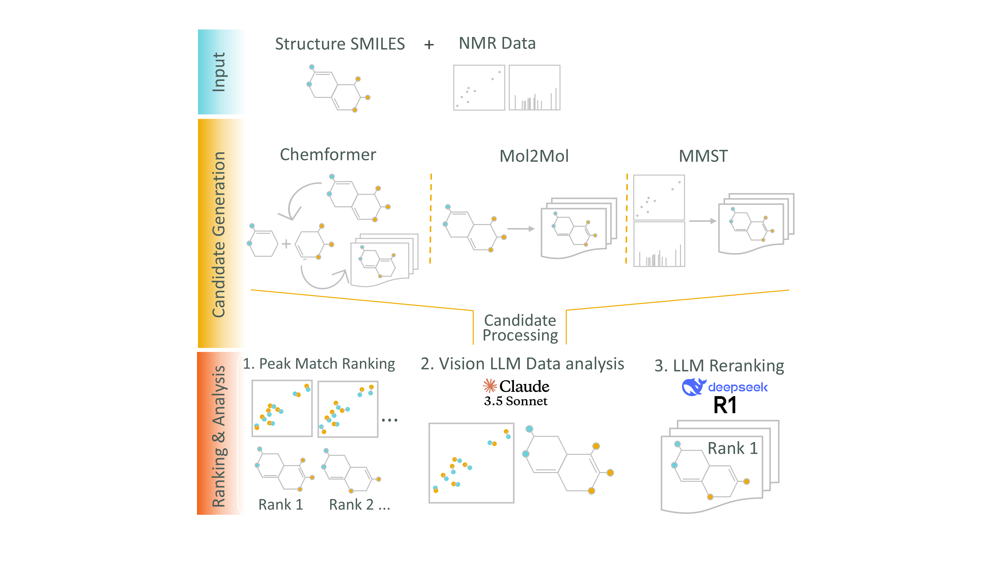

# ChemStructLLM: Enhancing Molecular Structure Elucidation with Reasoning-Capable LLMs 


[](https://zenodo.org/records/15317373)

This repository contains the implementation of our paper: "Enhancing Molecular Structure Elucidation with Reasoning-Capable LLMs" by Martin Priessner, Richard J. Lewis, Magnus J. Johansson, Jonathan M. Goodman, Jon Paul Janet, and Anna Tomberg.

## Overview

We introduce a novel workflow integrating reasoning-capable language models with specialized chemical analysis tools to enhance molecular structure determination using nuclear magnetic resonance spectroscopy. Our framework combines:

1. **Diverse Candidate Generation**: Using Chemformer, Mol2Mol, and MultiModalSpectralTransformer (MMST) approaches
2. **Quantitative Analysis**: HSQC peak matching and spectral prediction
3. **LLM-Driven Reasoning**: Advanced interpretation of spectral evidence with chemical context

This integrated approach significantly improves structure elucidation accuracy, particularly for noisy or ambiguous spectral data.

## Repository Structure

- **LLM_Structure_Elucidator/**: Main framework for LLM-driven structure elucidation
  - **agents/**: Core agent implementations and orchestration
  - **agents/scripts/**: Individual analysis scripts for different tools
  - **agents/tools/**: Tool implementations (MMST, Mol2Mol, Peak Matching, etc.)
- **utils_MMT/**: Configuration files and utilities for MMST

## Installation and Environment Setup

### Base Environment (LLM Structure Elucidator)

The main LLM Structure Elucidator requires a base Python environment with the following packages:

```bash
# Create and activate base environment
conda create -n LLM_312 python=3.12
conda activate LLM_312

# Install requirements
pip install -r requirements.txt
```

### Specialized Tool Environments

Different analysis tools require specialized environments with specific dependencies:

#### 1. MMST Environment (`NMR_Structure_Elucidator`)

For MultiModalSpectralTransformer and Mol2Mol analysis:

```bash
# Create MMST environment
conda create -n NMR_Structure_Elucidator python=3.9
conda activate NMR_Structure_Elucidator

# Install PyTorch with CUDA support
conda install pytorch torchvision torchaudio pytorch-cuda=11.8 -c pytorch -c nvidia

# Install additional dependencies
pip install pytorch-lightning==2.4.0
pip install rdkit==2023.9.5
pip install pandas numpy matplotlib scipy
pip install transformers==4.35.2
pip install tensorboard wandb
pip install dgl  # For graph neural networks
```

#### 2. Chemformer Environment (`chemformer`)

For Chemformer forward and retrosynthesis prediction:

```bash
# Change to the chemformer directory first
cd chemformer_public

# Create Chemformer environment from YAML file
conda env create -f env-dev.yml
conda activate chemformer

# Install dependencies using poetry
poetry install

# For developers: Enable editable mode
pip install -e .

# Note: If you encounter the error "ImportError: /lib64/libstdc++.so.6: version `GLIBCXX_3.4.21' not found", 
# add the conda environment's lib directory to LD_LIBRARY_PATH:
export LD_LIBRARY_PATH=/path/to/your/conda/envs/chemformer/lib
```

#### 3. SGNN Environment

For Spectral Graph Neural Networks and Mol2Mol analysis:

```bash
# No separate installation needed - SGNN and mol2mol run natively with MMST installation
# Use the NMR_Structure_Elucidator environment created above
conda activate NMR_Structure_Elucidator
```

**Note:** SGNN and mol2mol tools are included in the MMST installation and don't require separate environment setup.

### Directory Structure Setup

Ensure the following directory structure relative to ChemStructLLM_:

```
parent_directory/
├── ChemStructLLM_/                    # This repository
│   ├── LLM_Structure_Elucidator/      # Main framework
│   ├── MultiModalSpectralTransformer/ # Cloned MMST repo
│   ├── utils_MMT/                     # MMST configurations
│   └── requirements.txt               # Base environment deps
├── data/                              # Training and test datasets
│   └── ZINK_dataset/                  # NMR datasets
├── models/                            # Pre-trained models
│   ├── mmst/base_models/              # MMST checkpoints
│   ├── mol2mol/Alessandro_big/        # Mol2Mol models
│   └── chemformer/                    # Chemformer models
├── experiments/                       # Experiment outputs
└── itos.json, stoi.json              # Vocabulary files
```

## Agent Scripts Usage

The framework includes several specialized scripts in `LLM_Structure_Elucidator/agents/scripts/`:

### 1. MMST Analysis
```bash
# Activate MMST environment
conda activate NMR_Structure_Elucidator

# Run MMST script
cd LLM_Structure_Elucidator/agents/scripts
./mmst_local.sh --input_csv input.csv --run_dir output_dir
```

### 2. Mol2Mol Generation
```bash
# Uses NMR_Structure_Elucidator environment
conda activate NMR_Structure_Elucidator

# Run Mol2Mol script
./mol2mol_local.sh --input_csv molecules.csv --output_dir results/
```

### 3. Chemformer Analysis
```bash
# Activate Chemformer environment
conda activate chemformer

# Run Chemformer forward prediction
./chemformer_forward_local.sh --input_file targets.txt --output_file predictions.csv
```

### 4. Peak Matching
```bash
# Uses base environment
conda activate LLM_312

# Run peak matching analysis
./peak_matching_local.sh
```

### 5. SGNN Analysis
```bash
# Uses NMR_Structure_Elucidator environment
conda activate NMR_Structure_Elucidator

# Run SGNN script
./sgnn_local.sh
```

## Configuration

### MMST Configuration

The MMST tool uses configuration files in `utils_MMT/config_V8.json`. Key settings:

- **Model checkpoint**: Points to pre-trained MMST model
- **Training mode**: Specifies which spectral data types to use (1H, 13C, HSQC, COSY)
- **Data paths**: Relative paths to training datasets

### Environment Variables

Set the following environment variables:

```bash
export WANDB_DIR="./wandb"  # For experiment tracking
export CUDA_VISIBLE_DEVICES=0  # GPU selection
```

### API Key Configuration

The system supports multiple AI models for chat and analysis. Configure API keys as follows:

1. **Copy the template file**:
   ```bash
   cp LLM_Structure_Elucidator/config/config.template.py LLM_Structure_Elucidator/config/config.py
   ```

2. **Edit the config file** and replace placeholder values with your actual API keys:
   ```python
   # Available API keys to configure:
   anthropic_api_key = "your-anthropic-api-key-here"     # Claude models
   openai_api_key = "your-openai-api-key-here"           # GPT models
   gemini_api_key = "your-google-api-key-here"           # Gemini models
   deepseek_api_key = "your-deepseek-api-key-here"       # DeepSeek models
   deepseek_azure_api_key = "your-deepseek-azure-api-key-here"
   kimi_api_key = "your-kimi-api-key-here"               # Kimi models
   elevenlabs_key = "your-elevenlabs-api-key-here"       # Text-to-speech
   ```

3. **Note**: You only need to configure the API keys for the models you plan to use.

## Data and Model Setup from Zenodo

The complete dataset and pre-trained models are available on Zenodo:
[](https://zenodo.org/records/15422441)

### Download Required Files

Download the following archives from the Zenodo repository:
- `models.zip` - Pre-trained models (Chemformer, MMST, Mol2Mol)
- `data_molecular_structure.zip` - Example molecular data and test cases
- `intermediate_results_selected.zip` - Pre-computed workflow results for analysis

### Extract Files to Correct Locations

1. **Extract models**:
   ```bash
   cd ChemStructLLM_
   unzip models.zip
   # This creates: models/chemformer/, models/mmst/, models/mol2mol/
   ```

2. **Extract molecular data**:
   ```bash
   cd LLM_Structure_Elucidator
   unzip data_molecular_structure.zip
   # This creates: data/molecular_data/ with example files
   ```

3. **Extract workflow results** (for Jupyter notebook analysis):
   ```bash
   cd LLM_Structure_Elucidator
   unzip intermediate_results_selected.zip
   # This creates: _temp_folder/intermediate_results/ with example runs
   ```

### Verify Installation

After extraction, your directory structure should include:
```
ChemStructLLM_/
├── models/
│   ├── chemformer/
│   ├── mmst/base_models/
│   └── mol2mol/Alessandro_big/
└── LLM_Structure_Elucidator/
    ├── data/molecular_data/
    │   ├── molecular_data.json
    │   └── archive/
    └── _temp_folder/intermediate_results/
        ├── _run_1_sim_finished/
        ├── _run_2_sim_aug_finished/
        └── ... (additional run folders)
```

**Note**: These files are essential for reproducing the experimental results and running the complete workflow analysis.

## Usage

### Interactive Web Interface

For comprehensive instructions on using the interactive web interface and running structure elucidation workflows, see:

**📖 [USER_GUIDE.md](USER_GUIDE.md)** - Complete guide covering:
- System setup and configuration
- Data upload and format requirements
- Interactive molecule exploration
- NMR data visualization
- Structure elucidation workflow execution
- Script configuration for different environments
- End-to-end workflow examples

### Data Analysis and Visualization

For analysis and visualization of workflow results, please refer to the Jupyter notebooks provided in the examples directory. These notebooks contain data visualization tools and analysis of completed structure elucidation workflows.

## Datasets and Code

The full dataset and code used in our experiments is available on Zenodo:
[](https://zenodo.org/records/15317373)

We recommend downloading the complete repository from Zenodo to ensure all dependencies and files are properly organized.

This includes:
- Experimental NMR data for 34 diverse organic molecules
- Regioisomeric analogs for testing structure recovery
- Simulated spectral data with controlled noise
- All necessary code and model files

## Citation

If you use this code or our methods in your research, please cite our paper:

```bibtex
@article{priessner2025enhancing,
  title={Enhancing Molecular Structure Elucidation with Reasoning-Capable LLMs},
  author={Priessner, Martin and Lewis, Richard J. and Johansson, Magnus J. and Goodman, Jonathan M. and Janet, Jon Paul and Tomberg, Anna},
  journal={},
  year={2025}
}
```

## License

This project is licensed under the MIT License - see the LICENSE file for details.

## Acknowledgments

We gratefully acknowledge AstraZeneca for their support and funding of the Postdoctoral position, instrumental in the success of this research.
