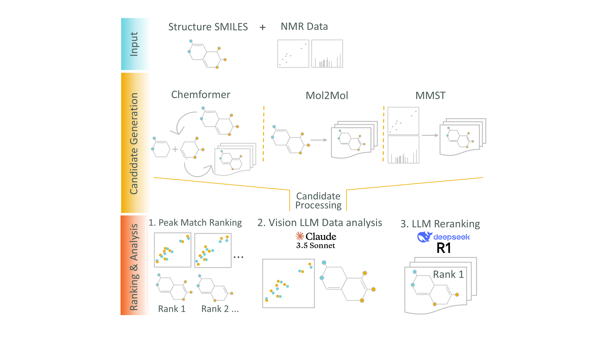

# ChemStructLLM: Enhancing Molecular Structure Elucidation with Reasoning-Capable LLMs 


[](https://zenodo.org/records/15317373)

This repository contains the implementation of our paper: "Enhancing Molecular Structure Elucidation with Reasoning-Capable LLMs" by Martin Priessner, Richard J. Lewis, Magnus J. Johansson, Jonathan M. Goodman, Jon Paul Janet, and Anna Tomberg.

## Overview

We introduce a novel workflow integrating reasoning-capable language models with specialized chemical analysis tools to enhance molecular structure determination using nuclear magnetic resonance spectroscopy. Our framework combines:

1. **Diverse Candidate Generation**: Using Chemformer, Mol2Mol, and MultiModalSpectralTransformer (MMST) approaches
2. **Quantitative Analysis**: HSQC peak matching and spectral prediction
3. **LLM-Driven Reasoning**: Advanced interpretation of spectral evidence with chemical context

This integrated approach significantly improves structure elucidation accuracy, particularly for noisy or ambiguous spectral data.

## Repository Structure

- **LLM_Structure_Elucidator/**: Main framework for LLM-driven structure elucidation
  - **agents/**: Core agent implementations and orchestration
  - **agents/scripts/**: Individual analysis scripts for different tools
  - **agents/tools/**: Tool implementations (MMST, Mol2Mol, Peak Matching, etc.)
- **utils_MMT/**: Configuration files and utilities for MMST

## Installation and Environment Setup

### Base Environment (LLM Structure Elucidator)

The main LLM Structure Elucidator requires a base Python environment with the following packages:

```bash
# Create and activate base environment
conda create -n LLM_312 python=3.12
conda activate LLM_312

# Install requirements
pip install -r requirements.txt
```

### Specialized Tool Environments

Different analysis tools require specialized environments with specific dependencies:

#### 1. MMST Environment (`NMR_Structure_Elucidator`)

For MultiModalSpectralTransformer and Mol2Mol analysis:

```bash
# Create MMST environment
conda create -n NMR_Structure_Elucidator python=3.9
conda activate NMR_Structure_Elucidator

# Install PyTorch with CUDA support
conda install pytorch torchvision torchaudio pytorch-cuda=11.8 -c pytorch -c nvidia

# Install additional dependencies
pip install pytorch-lightning==2.4.0
pip install rdkit==2023.9.5
pip install pandas numpy matplotlib scipy
pip install transformers==4.35.2
pip install tensorboard wandb
pip install dgl  # For graph neural networks
```

#### 2. Chemformer Environment (`chemformer`)

For Chemformer forward and retrosynthesis prediction:

```bash
# Change to the chemformer directory first
cd chemformer_public

# Create Chemformer environment from YAML file
conda env create -f env-dev.yml
conda activate chemformer

# Install dependencies using poetry
poetry install

# For developers: Enable editable mode
pip install -e .

# Note: If you encounter the error "ImportError: /lib64/libstdc++.so.6: version `GLIBCXX_3.4.21' not found", 
# add the conda environment's lib directory to LD_LIBRARY_PATH:
export LD_LIBRARY_PATH=/path/to/your/conda/envs/chemformer/lib
```

#### 3. SGNN Environment

For Spectral Graph Neural Networks and Mol2Mol analysis:

```bash
# No separate installation needed - SGNN and mol2mol run natively with MMST installation
# Use the NMR_Structure_Elucidator environment created above
conda activate NMR_Structure_Elucidator
```

**Note:** SGNN and mol2mol tools are included in the MMST installation and don't require separate environment setup.

### Directory Structure Setup

Ensure the following directory structure relative to ChemStructLLM_:

```
parent_directory/
├── ChemStructLLM_/                    # This repository
│   ├── LLM_Structure_Elucidator/      # Main framework
│   ├── MultiModalSpectralTransformer/ # Cloned MMST repo
│   ├── utils_MMT/                     # MMST configurations
│   └── requirements.txt               # Base environment deps
├── data/                              # Training and test datasets
│   └── ZINK_dataset/                  # NMR datasets
├── models/                            # Pre-trained models
│   ├── mmst/base_models/              # MMST checkpoints
│   ├── mol2mol/Alessandro_big/        # Mol2Mol models
│   └── chemformer/                    # Chemformer models
├── experiments/                       # Experiment outputs
└── itos.json, stoi.json              # Vocabulary files
```

## Agent Scripts Usage

The framework includes several specialized scripts in `LLM_Structure_Elucidator/agents/scripts/`:

### 1. MMST Analysis
```bash
# Activate MMST environment
conda activate NMR_Structure_Elucidator

# Run MMST script
cd LLM_Structure_Elucidator/agents/scripts
./mmst_local.sh --input_csv input.csv --run_dir output_dir
```

### 2. Mol2Mol Generation
```bash
# Uses NMR_Structure_Elucidator environment
conda activate NMR_Structure_Elucidator

# Run Mol2Mol script
./mol2mol_local.sh --input_csv molecules.csv --output_dir results/
```

### 3. Chemformer Analysis
```bash
# Activate Chemformer environment
conda activate chemformer

# Run Chemformer forward prediction
./chemformer_forward_local.sh --input_file targets.txt --output_file predictions.csv
```

### 4. Peak Matching
```bash
# Uses base environment
conda activate LLM_312

# Run peak matching analysis
./peak_matching_local.sh
```

### 5. SGNN Analysis
```bash
# Uses NMR_Structure_Elucidator environment
conda activate NMR_Structure_Elucidator

# Run SGNN script
./sgnn_local.sh
```

## Configuration

### MMST Configuration

The MMST tool uses configuration files in `utils_MMT/config_V8.json`. Key settings:

- **Model checkpoint**: Points to pre-trained MMST model
- **Training mode**: Specifies which spectral data types to use (1H, 13C, HSQC, COSY)
- **Data paths**: Relative paths to training datasets

### Environment Variables

Set the following environment variables:

```bash
export WANDB_DIR="./wandb"  # For experiment tracking
export CUDA_VISIBLE_DEVICES=0  # GPU selection
```

## Usage

For detailed usage instructions, please refer to the Jupyter notebooks provided in the examples directory. These notebooks contain step-by-step experimental procedures and demonstrations of the framework's capabilities.

## Datasets and Code

The full dataset and code used in our experiments is available on Zenodo:
[](https://zenodo.org/records/15317373)

We recommend downloading the complete repository from Zenodo to ensure all dependencies and files are properly organized.

This includes:
- Experimental NMR data for 34 diverse organic molecules
- Regioisomeric analogs for testing structure recovery
- Simulated spectral data with controlled noise
- All necessary code and model files

## Citation

If you use this code or our methods in your research, please cite our paper:

```bibtex
@article{priessner2025enhancing,
  title={Enhancing Molecular Structure Elucidation with Reasoning-Capable LLMs},
  author={Priessner, Martin and Lewis, Richard J. and Johansson, Magnus J. and Goodman, Jonathan M. and Janet, Jon Paul and Tomberg, Anna},
  journal={},
  year={2025}
}
```

## License

This project is licensed under the MIT License - see the LICENSE file for details.

## Acknowledgments

We gratefully acknowledge AstraZeneca for their support and funding of the Postdoctoral position, instrumental in the success of this research.
