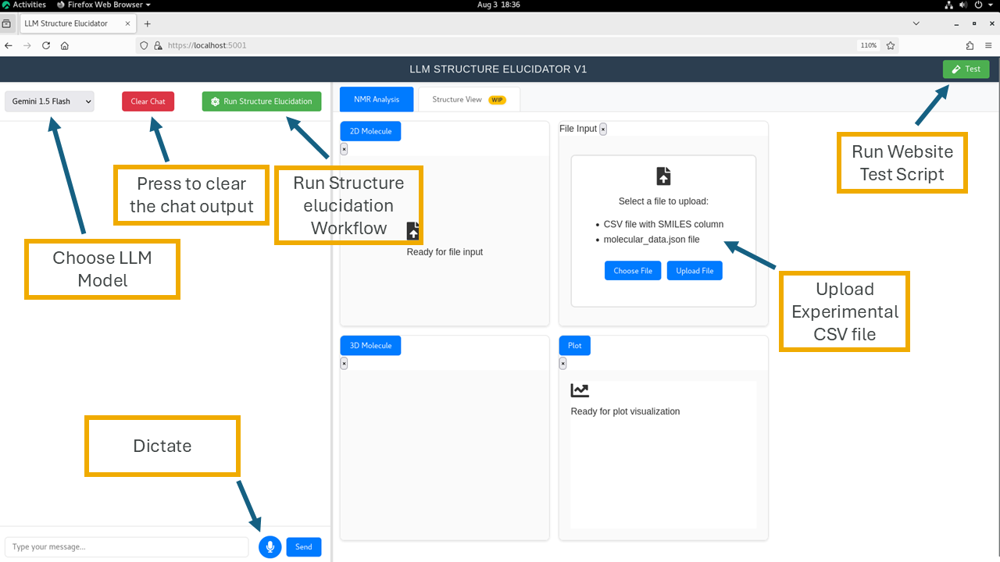
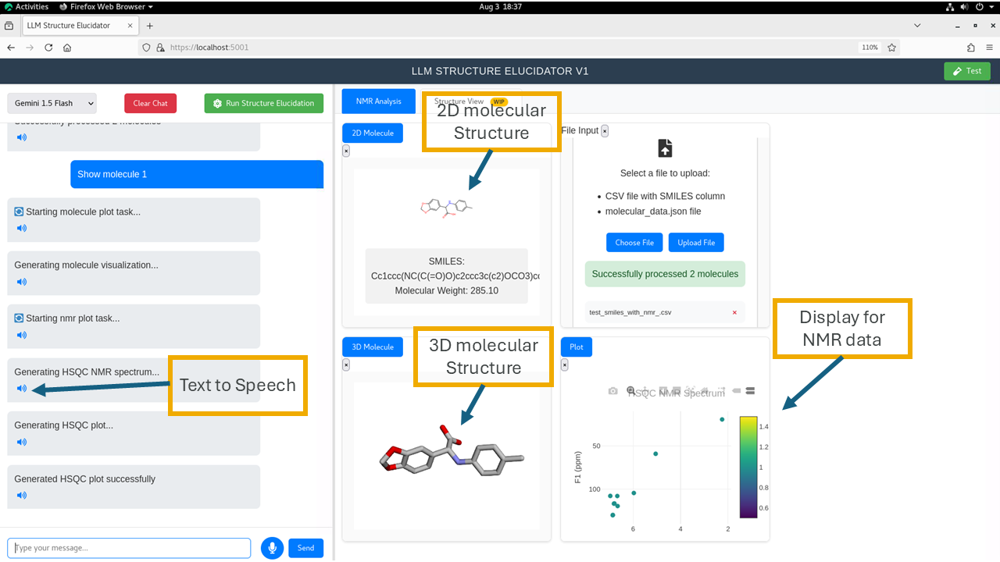
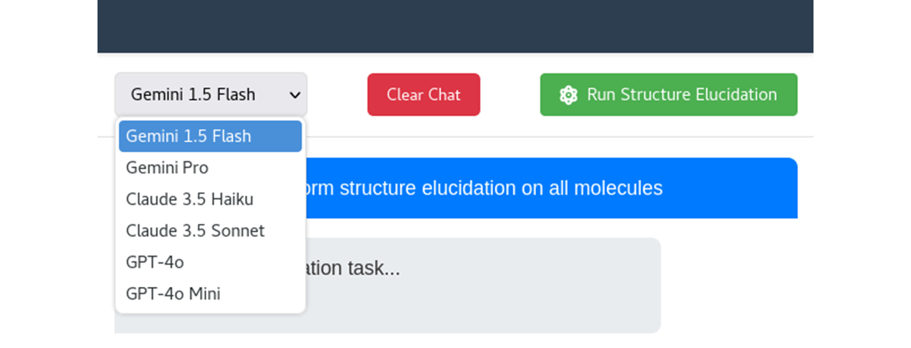
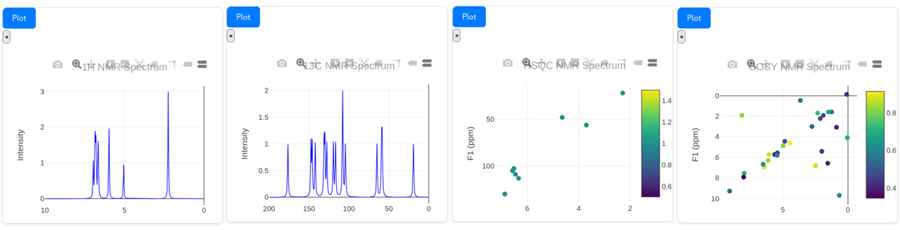
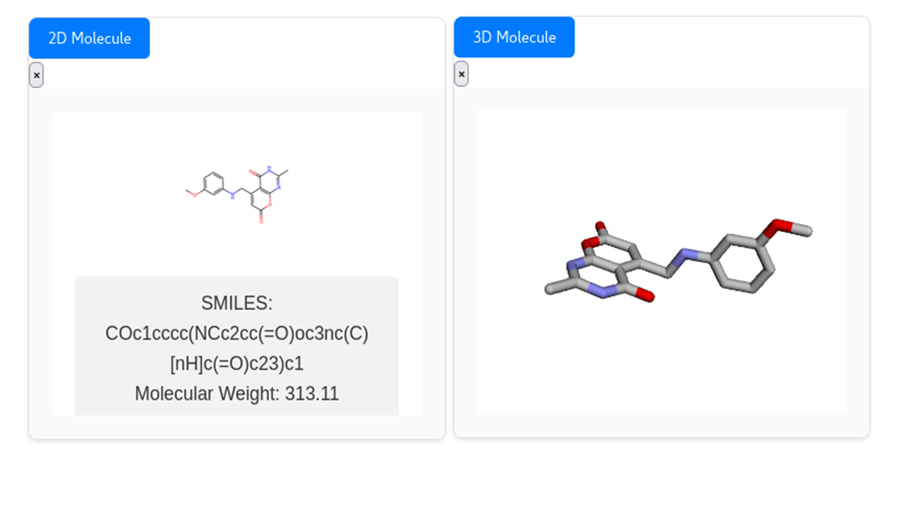

# ChemStructLLM User Guide

## Overview

ChemStructLLM is an AI-powered structure elucidation tool that combines experimental NMR data with large language models to assist in molecular structure determination. This guide will walk you through all the features and how to use them effectively.

## Getting Started

### 1. Starting the Application

Run the application using:
```bash
python app.py
```

The web interface will be available at `http://localhost:5000`

**📸 Screenshot needed:** *Main application startup screen*

### 2. Remote Server Access (SSH Tunneling)

If you're running ChemStructLLM on a remote server or cluster node, you'll need to set up SSH tunneling to access the web interface from your local machine.

#### Setting Up SSH Tunnel

1. **Basic SSH Tunnel Setup**
   ```bash
   ssh -L 5000:localhost:5000 username@remote-server.domain.com
   ```

2. **Custom Port Tunneling** (if port 5000 is occupied)
   ```bash
   # Tunnel remote port 5000 to local port 5001
   ssh -L 5001:localhost:5000 username@remote-server.domain.com
   
   # Then access via: http://localhost:5001
   ```

3. **Example for Cluster Access**
   ```bash
   # Replace with your actual username and server
   ssh -L 5001:localhost:5000 your_username@cluster-node-name
   ```

#### After SSH Tunnel is Established

1. **On the remote server**, start the application:
   ```bash
   cd LLM_Structure_Elucidator
   python run.py
   # Application runs on remote localhost:5000
   ```

2. **On your local machine**, open your browser and navigate to:
   - `http://localhost:5000` (if using direct port mapping)
   - `http://localhost:5001` (if using custom port mapping)

#### Troubleshooting SSH Tunneling

- **Port already in use**: Try a different local port (e.g., 5001, 5002)
- **Connection refused**: Ensure the application is running on the remote server
- **Tunnel drops**: Add `-o ServerAliveInterval=60` to keep connection alive
  ```bash
  ssh -L 5001:localhost:5000 -o ServerAliveInterval=60 username@server
  ```


---

## Core Features

### 1. File Upload and Data Management

#### Uploading Experimental Data


*Main interface showing file upload area, chat panel, and key control buttons*

1. **Choose Your Data File**
   - Click the **"Choose File"** or **"Upload File"** buttons in the File Input panel
   - Drag and drop your CSV file into the upload area
   - Supported format: CSV files containing experimental NMR data
   - Required columns: `SMILES`, `Sample_ID`, `1H_NMR`, `13C_NMR`, `HSQC`, `COSY`

2. **File Processing**
   - The system automatically parses your CSV data
   - Molecular structures are generated from SMILES strings
   - NMR data is stored and linked to each molecule
   - Success message shows "Successfully processed X molecules"

**Key Interface Elements:**
- **LLM Model Selection**: Choose your AI model (Gemini 1.5 Flash shown)
- **Clear Chat**: Press to clear the chat output
- **Run Structure Elucidation**: Start the main workflow
- **File Input Panel**: Upload your experimental data
- **Chat Interface**: Text input and voice dictation

#### Supported Data Format

Your CSV file should contain:
```csv
SMILES,Sample_ID,1H_NMR,13C_NMR,HSQC,COSY
"Cc1ccc(NC(C(=O)O)c2ccc3c(c2)OCO3)cc1","SAMPLE002","[(2.2513137, 3), (5.049414, 1), (5.968915, 2), (6.631792, 0.5), ...]","[19.225267, 58.290585, 59.04912, 64.90056, 104.40221, ...]","[[2.2513137, 19.225267], [5.049414, 59.04912], [5.968915, 104.40221], ...]","[(2.2513137, 2.2513137), (5.049414, 5.049414), (6.651792, 6.6657114), ...]"
```

**Data Format Explanation:**
- **1H NMR**: `[(chemical_shift, intensity), (chemical_shift, intensity), ...]`
  - Example: `[(2.2513137, 3), (5.049414, 1)]` = peak at 2.25 ppm with intensity 3
- **13C NMR**: `[chemical_shift, chemical_shift, chemical_shift, ...]`
  - Example: `[19.225267, 58.290585, 59.04912]` = carbon peaks at these chemical shifts
- **HSQC**: `[[1H_shift, 13C_shift], [1H_shift, 13C_shift], ...]`
  - Example: `[[2.2513137, 19.225267], [5.049414, 59.04912]]` = correlations between 1H and 13C
- **COSY**: `[(1H_shift1, 1H_shift2), (1H_shift1, 1H_shift2), ...]`
  - Example: `[(2.2513137, 2.2513137), (6.651792, 6.6657114)]` = proton-proton correlations

---

### 2. Interactive Chat Interface

#### Text-Based Interaction

1. **Type Your Queries**
   - Use the text input at the bottom of the chat panel
   - Ask questions about molecules, request NMR plots, or seek analysis
   - Examples:
     - "Show me the 1H NMR spectrum"
     - "Display molecule 1"
     - "What is the molecular weight?"

2. **Send Messages**
   - Click the "Send" button or press Enter
   - The AI will process your request and provide responses
   - Chat history shows processing steps and results


*Interface showing molecular visualization, NMR data analysis, and text-to-speech functionality*

#### Voice Interaction

1. **Voice Input**
   - Click the **"Dictate"** button in the chat input area
   - Speak your question clearly
   - The system will convert speech to text automatically

2. **Voice Output (Text to Speech)**
   - Click the **"Text to Speech"** button to have AI responses read aloud
   - Useful for hands-free operation during analysis
   - Toggle audio output as needed

**Key Features Shown:**
- **2D Molecular Structure**: Chemical structure visualization
- **3D Molecular Structure**: Interactive 3D molecular models
- **NMR Data Visualization**: Real-time spectral data plotting
- **Chat Processing**: Step-by-step workflow execution
- **SMILES Display**: Molecular formula and weight information

---

### 3. AI Model Selection

#### Choosing Your AI Model


*AI model dropdown showing available models for chat interface interaction*

1. **Model Options**
   - Multiple AI models available (GPT, Claude, Gemini, etc.)
   - Each model has different strengths for chemical analysis
   - Switch models based on your specific needs

2. **Model Selection**
   - Use the model dropdown in the chat interface
   - **Important**: This selection only affects chat interactions and interface responses
   - Background analysis workflows use pre-configured models
   - Changes take effect for subsequent chat queries
   - Previous conversation history is maintained

**Chat vs Background Processing:**
- **Chat Interface**: Uses your selected model for answering questions and providing explanations
- **Structure Elucidation Workflow**: Uses specialized models optimized for each analysis step
- **NMR Analysis**: Uses dedicated models trained on spectroscopic data

---

### 4. NMR Data Visualization

#### Available NMR Spectra

1. **1D NMR Spectra**
   - **1H NMR**: Proton NMR spectra
   - **13C NMR**: Carbon-13 NMR spectra
   - Request with: "show 1H" or "show 13C"

2. **2D NMR Spectra**
   - **HSQC**: Heteronuclear Single Quantum Coherence
   - **COSY**: Correlation Spectroscopy
   - Request with: "show HSQC" or "show COSY"

#### Viewing Spectra

1. **Request Spectra**
   - Type your request in the chat: "show HSQC"
   - The system uses your uploaded experimental data
   - Interactive plots appear in the visualization panel

2. **Plot Features**
   - Zoom and pan capabilities
   - Peak identification
   - Integration values (where applicable)


*Complete NMR visualization suite showing 1H, 13C, HSQC, and COSY spectra from experimental data*

**Available NMR Plot Types:**
- **1H NMR**: Proton spectrum with chemical shifts and peak intensities
- **13C NMR**: Carbon spectrum showing all carbon environments
- **HSQC**: 2D correlation between 1H and 13C nuclei
- **COSY**: 2D correlation showing proton-proton coupling

**Interactive Features:**
- Real-time plotting of experimental data
- Zoom and pan functionality
- Peak picking and integration
- Export capabilities for further analysis

---

### 5. Molecular Visualization

#### 2D Molecular Structures

1. **Viewing Molecules**
   - Request specific molecules: "show mol 1"
   - 2D structures are automatically generated
   - High-quality chemical structure drawings

2. **Molecule Navigation**
   - Browse through uploaded molecules
   - Compare different structures side-by-side

#### 3D Molecular Models

1. **3D Visualization**
   - Interactive 3D molecular models
   - Rotate, zoom, and explore molecular geometry
   - Useful for understanding stereochemistry


*2D and 3D molecular visualization showing chemical structure and interactive 3D model*

**Visualization Features:**
- **2D Structure**: High-quality chemical structure drawings with proper bond representation
- **3D Model**: Interactive molecular geometry with realistic atomic positions
- **SMILES Information**: Molecular formula and molecular weight display
- **Rotation Controls**: Mouse-driven 3D model manipulation
- **Zoom Functionality**: Detailed examination of molecular features
- **Stereochemistry**: Clear visualization of spatial arrangements

---

### 6. Structure Elucidation Workflow

#### Running the Elucidation Process

1. **The Green Button** 🟢
   - Located in the chat interface: "Run Structure Elucidation"
   - Initiates the complete AI-powered analysis workflow
   - Combines all available NMR data with AI reasoning

2. **Workflow Process**
   - **Data Integration**: Combines 1H, 13C, HSQC, and COSY data
   - **AI Analysis**: Multiple AI agents analyze different aspects
   - **Structure Prediction**: Generates possible molecular structures
   - **Confidence Scoring**: Provides reliability metrics

3. **Output Generation**
   - Creates a comprehensive JSON file with results
   - Contains all analysis steps and reasoning
   - Includes structure predictions and confidence scores

**📸 Screenshots needed:**
- *Structure elucidation button*
- *Workflow progress indicators*
- *Generated JSON output preview*

#### Understanding the Results

The generated JSON file contains:
```json
{
  "analysis_results": {
    "molecular_formula": "C16H15NO4",
    "predicted_structures": [...],
    "confidence_scores": {...},
    "nmr_analysis": {...},
    "ai_reasoning": [...]
  }
}
```

---

### 7. Advanced Analysis with Jupyter Notebooks

#### Post-Processing Analysis

1. **Generated Data Files**
   - JSON files contain complete analysis results
   - Located in the `results/` directory
   - Timestamped for easy identification

2. **Jupyter Notebook Integration**
   - Use provided analysis notebooks
   - Load JSON results for detailed examination
   - Create custom visualizations and reports

3. **Available Notebooks**
   - `structure_analysis.ipynb`: Detailed structure comparison
   - `nmr_interpretation.ipynb`: Advanced NMR analysis
   - `confidence_evaluation.ipynb`: Result validation

---

### 8. Customizing the Workflow

#### Workflow Configuration Options

1. **Workflow Step Definitions**
   - **File**: `LLM_Structure_Elucidator/agents/orchestrator/workflow_definitions.py`
   - Define custom workflow steps and their execution order
   - Modify analysis pipeline components
   - Set step dependencies and requirements

   ```python
   # Example workflow step definition
   WORKFLOW_STEPS = {
       'threshold_calculation': WorkflowStep(
           keyword='threshold_calculation',
           command='Calculate dynamic thresholds for spectral data analysis',
           description='Calculate spectral analysis thresholds',
           requires=[]
       ),
       'retrosynthesis': WorkflowStep(
           keyword='retrosynthesis', 
           command='Run retrosynthesis analysis on target structure',
           description='Perform retrosynthesis analysis',
           requires=[]
       )
   }
   ```

#### Customizing Workflow Sequences

You can customize which analysis steps are executed by modifying the `WORKFLOW_SEQUENCES` in the same file:

**Example - TARGET_ONLY Workflow:**
```python
WorkflowType.TARGET_ONLY: [
    # WORKFLOW_STEPS['threshold_calculation'],    # Commented out - not executed
    # WORKFLOW_STEPS['nmr_simulation'],           # Commented out - not executed  
    # WORKFLOW_STEPS['peak_matching'],            # Commented out - not executed
    WORKFLOW_STEPS['retrosynthesis'],             # Active - will be executed
    WORKFLOW_STEPS['forward_prediction'],         # Active - will be executed
    WORKFLOW_STEPS['forward_candidate_analysis'], # Active - will be executed
    WORKFLOW_STEPS['mol2mol'],                    # Active - will be executed
    WORKFLOW_STEPS['mol2mol_candidate_analysis'], # Active - will be executed
    WORKFLOW_STEPS['mmst'],                       # Active - will be executed
    WORKFLOW_STEPS['mmst_candidate_analysis'],    # Active - will be executed
    WORKFLOW_STEPS['analysis']                    # Active - will be executed
]
```

**To Enable/Disable Steps:**
1. **Enable a step**: Remove the `#` at the beginning of the line
   ```python
   WORKFLOW_STEPS['threshold_calculation'],  # Now active
   ```

2. **Disable a step**: Add `#` at the beginning of the line
   ```python
   # WORKFLOW_STEPS['retrosynthesis'],  # Now disabled
   ```

**Available Analysis Steps:**
- `threshold_calculation`: Calculate dynamic thresholds for spectral analysis
- `nmr_simulation`: Simulate NMR spectra for comparison
- `peak_matching`: Match experimental peaks with predicted spectra
- `retrosynthesis`: Perform retrosynthetic analysis
- `forward_prediction`: Generate structure candidates using forward prediction
- `mol2mol`: Use Mol2Mol model for structure generation
- `mmst`: Use MultiModal Spectral Transformer for predictions
- `analysis`: Comprehensive LLM-driven analysis of results

**Workflow Types:**
- `TARGET_ONLY`: Analysis when you have a target structure
- `STARTING_MATERIAL`: Analysis starting from known materials
- `MULTIPLE_TARGETS`: Analysis with multiple target candidates
- `SPECTRAL_ONLY`: Analysis using only spectral data

2. **Agent Configuration**
   - Located in `config/agent_config.json`
   - Modify AI model assignments for different tasks
   - Adjust analysis parameters

3. **NMR Processing Settings**
   - Configure peak picking algorithms
   - Adjust integration parameters
   - Set noise filtering options

4. **Structure Generation Options**
   - Modify structure prediction algorithms
   - Set confidence thresholds
   - Configure output formats

#### Script Configuration for Different Environments

**⚠️ IMPORTANT**: Before running the structure elucidation workflow, you must configure the execution scripts for your specific environment.

**Scripts Location**: `LLM_Structure_Elucidator/agents/scripts/`

**Available Scripts:**
- `chemformer_forward_sbatch.sh` / `chemformer_forward_local.sh`
- `chemformer_retro_sbatch.sh` / `chemformer_retro_local.sh`
- `mol2mol_sbatch.sh` / `mol2mol_local.sh`
- `mmst_sbatch.sh` / `mmst_local.sh`
- `sgnn_sbatch.sh` / `sgnn_local.sh`
- `peak_matching_local.sh`

**Required Modifications:**

1. **Environment Path Configuration**
   ```bash
   # Example from chemformer_forward_sbatch.sh
   # CHANGE THIS to your conda installation path:
   eval "$(/projects/cc/se_users/knlr326/miniconda_SE/bin/conda shell.bash hook)"
   
   # Update to your path:
   eval "$(/your/path/to/miniconda/bin/conda shell.bash hook)"
   ```

2. **Base Directory Paths**
   ```bash
   # Update these paths to match your installation:
   BASE_DIR="/your/path/to/ChemStructLLM_/LLM_Structure_Elucidator"
   CONFIG_BASE_DIR="/your/path/to/ChemStructLLM_"
   ```

3. **CUDA Module Loading** (for cluster environments)
   ```bash
   # Ensure correct CUDA version is loaded:
   module load CUDA/11.3.1
   # Or your cluster's CUDA module name
   ```

4. **Model and Vocabulary Paths**
   ```bash
   # Update model paths to your installation:
   MODEL_PATH="$CONFIG_BASE_DIR/chemformer_public/models/fined-tuned/uspto_mixed/last_v2.ckpt"
   VOCAB_PATH="$CONFIG_BASE_DIR/chemformer_public/bart_vocab_downstream.json"
   ```

5. **Execution Parameters** (customizable)
   ```bash
   # Adjust these based on your computational resources:
   BATCH_SIZE=64        # Reduce if memory limited
   N_BEAMS=10          # Increase for better results (slower)
   N_UNIQUE_BEAMS=-1   # Set to positive number to limit unique outputs
   ```

**SLURM Configuration** (for cluster environments):
```bash
#SBATCH --partition=short-gpu    # Change to your partition
#SBATCH --gres=gpu:1            # Adjust GPU requirements
#SBATCH --mem=64g               # Adjust memory requirements
#SBATCH --time=0-0:05:00        # Adjust time limits
```

**Steps to Configure:**
1. Navigate to `LLM_Structure_Elucidator/agents/scripts/`
2. Edit each `.sh` file you plan to use
3. Update all paths to match your installation
4. Modify SLURM parameters for your cluster (if applicable)
5. Test scripts individually before running full workflow

#### Customization Locations

```
ChemStructLLM/
├── config/
│   ├── agent_config.json      # AI agent settings
│   ├── nmr_config.json        # NMR processing parameters
│   └── workflow_config.json   # Overall workflow settings
├── agents/
│   ├── scripts/               # ⚠️ CONFIGURE THESE SCRIPTS
│   │   ├── *.sh              # Environment-specific paths
│   │   └── logs/             # Script execution logs
│   └── specialized/           # Individual agent implementations
└── workflows/
    └── elucidation/          # Structure elucidation workflows
```

---

## Interface Features

### Chat Management

1. **Clear Chat History**
   - Reset conversation for new analysis
   - Maintains uploaded data and current molecule selection

2. **Export Conversations**
   - Save chat history for documentation
   - Include AI reasoning and analysis steps

### Data Selection

1. **Molecule Selection**
   - Choose which uploaded molecule to analyze
   - Switch between different samples easily
   - Maintain context across different queries

2. **Spectrum Selection**
   - Choose which NMR data to display
   - Compare different spectral types
   - Overlay multiple spectra when relevant

**📸 Screenshots needed:**
- *Chat management controls*
- *Data selection interface*
- *Molecule switching demonstration*

---

## Tips for Best Results

### Data Preparation

1. **CSV File Quality**
   - Ensure SMILES strings are valid
   - Include all available NMR data types
   - Use consistent data formatting

2. **NMR Data Format**
   - Provide peak lists or full spectral data
   - Include integration values when available
   - Specify measurement conditions if relevant

### Effective Querying

1. **Specific Requests**
   - Be specific about what you want to see
   - Use standard NMR terminology
   - Ask follow-up questions for clarification

2. **Sequential Analysis**
   - Start with basic molecular information
   - Progress to specific spectral analysis
   - Use structure elucidation as final step

---

## Troubleshooting

### Common Issues

1. **File Upload Problems**
   - Check CSV format matches requirements
   - Ensure SMILES strings are valid
   - Verify file size is within limits

2. **NMR Display Issues**
   - Confirm experimental data was uploaded correctly
   - Check that molecule selection is active
   - Verify NMR data format in CSV

3. **AI Response Issues**
   - Try different AI models for varied perspectives
   - Rephrase questions if responses are unclear
   - Check internet connection for model access

### Getting Help

- Check the console logs for detailed error messages
- Review the generated JSON files for analysis details
- Consult the technical documentation for advanced configuration

---

## Conclusion

ChemStructLLM provides a comprehensive platform for AI-assisted structure elucidation. By combining experimental NMR data with advanced AI reasoning, it offers powerful tools for molecular analysis and structure determination.

For technical support or advanced customization, refer to the developer documentation or contact the development team.

---

*This guide covers the main features of ChemStructLLM. For the most current information and updates, please refer to the project repository.*
